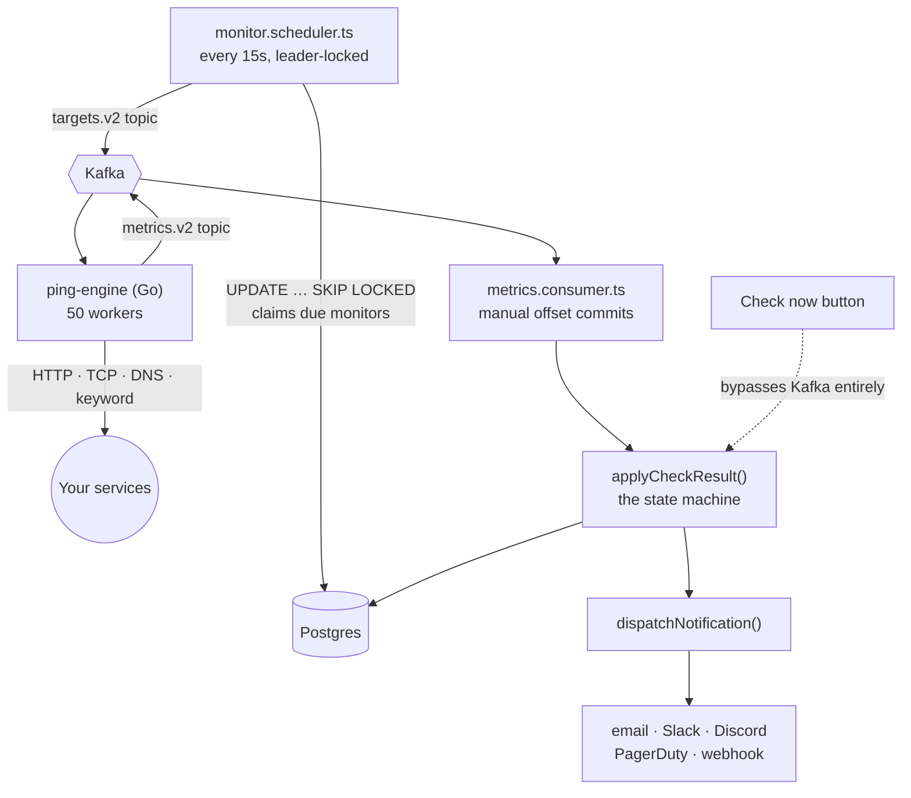

# PulseOps — Architecture & Reading Guide

A self-hostable uptime monitor: it pings your services on a schedule, records what
happened, opens incidents when things break, and tells people.

This document is the order to read the code in and the reason each piece exists.
For running the stack see [README.md](./README.md); for deploying it see
[DEPLOY.md](./DEPLOY.md).

| | |
| --- | --- |
| Backend | ~9,700 lines TypeScript |
| Frontend | ~13,000 lines TSX |
| CLI + TUI | ~4,800 lines |
| Go engine | ~700 lines |
| Database models | 20 |
| Compose services | 8 |

---

## 1. The mental model

Before any file: PulseOps does one loop, forever.

> **Decide what's due → probe it → record the result → react to the change.**

Almost every file belongs to one of those four verbs. When you get lost, ask which
verb you're in.

The thing that makes this more than a single Express file is that *probing* is slow,
parallel and network-bound, while *deciding* and *recording* are transactional and
need a database. So probing was pulled out into a separate Go service, and the two
halves talk over Kafka. That single decision explains the scheduler, the two Kafka
topics, the consumer, and most of the operational complexity.

> **Read this first.** There are two paths to a check result, and confusing them will
> cost you an hour. **Scheduled** checks go out over Kafka to the Go engine.
> **Check now** (the button in the UI) probes locally in Node and skips Kafka
> entirely, so it still works when the engine is down. Both converge on the same
> function: `applyCheckResult()`.

---

## 2. Repo map

| Path | What lives there | Stack |
| --- | --- | --- |
| `backend/` | The API, the scheduler, the state machine, all background jobs | Fastify · Prisma · Zod |
| `workers/ping-engine/` | The prober. Consumes targets, publishes results. Nothing else. | Go |
| `frontend/` | Dashboard + the public status page | Next.js 16 · RSC |
| `cli/` | `pulseops` npm package — CLI and a full-screen TUI | Ink · React |
| `mcp/` | MCP server so an AI agent can read your monitors | MCP SDK |
| `docs/` | A third Next.js app rendering the OpenAPI spec | Scalar |
| `caddy/`, `docker-compose*.yml` | Self-host: TLS, routing, whole stack in one command | Caddy · Compose |

The backend is organised by **feature module**, not by layer. Each folder in
`backend/src/modules/` is self-contained and follows the same four-file shape:

```
routes.ts       URL + HTTP method + which middleware guards it
controller.ts   parse/validate input, call service, shape response
service.ts      the actual logic + database access
schema.ts       Zod shapes — the single source of truth for input
```

Nine modules: `auth`, `workspaces`, `monitors`, `incidents`, `notifications`,
`webhooks`, `status`, `telemetry`, `billing`. Shared plumbing sits in `src/lib/`
(db, redis, kafka, jwt, session, ssrf, hash, email) and cross-cutting guards in
`src/middleware/`.

---

## 3. The reading path

Twelve stops, in order. Each assumes the one before it. Budget an evening for
stops 1–6 — that's the spine, and everything after is elaboration.

### 1. `backend/prisma/schema.prisma`

Every model, 20 of them, in one file with comments explaining the non-obvious ones.

*Why here:* Start at the data. If you understand `Monitor`, `MonitorCheck` and
`Incident` and how they relate, the rest of the backend is mostly plumbing moving
rows between those three tables.

### 2. `backend/src/app.ts`

The composition root. Reads top to bottom: CORS → rate limit → OpenAPI → error
handler → health probes → route registration → background jobs.

*Why here:* This one file tells you every URL prefix that exists and every loop that
runs. Note `start()` near the bottom — five background jobs boot in the same process
as the API.

### 3. `backend/src/modules/monitors/monitor.routes.ts`

Pick one endpoint — `GET /workspaces/:workspaceId/monitors` — and follow it by hand
into the controller, then the service, then Prisma.

*Why here:* Do this once, slowly. Every other endpoint is the same four-step walk,
so paying attention here buys you the other ~60 routes for free.

### 4. `backend/src/middleware/workspace-access.middleware.ts`

The authorization core. Collapses two very different callers — a human with a JWT
and a script with an API key — into one `AccessContext`.

*Why here:* The comments explain a genuinely subtle bug class: route-level checks
validate the workspace *in the URL*, but services re-resolve the workspace *from the
resource*. If those disagree, you get cross-tenant access. Read
`assertWorkspaceAccess` and `assertWorkspaceRole` together.

### 5. `backend/src/modules/monitors/monitor.engine.ts`

575 lines and the most important file in the repo. Contains `performPing()` (the
local prober) and `applyCheckResult()` (the state machine).

*Why here:* This is where a raw probe outcome becomes product behaviour: grace
thresholds, UP/DOWN/DEGRADED transitions, maintenance suppression, SSL verdicts, the
atomic transaction, and the alert fan-out. If you only read one file, read this one
— twice.

### 6. `monitor.scheduler.ts` → `workers/ping-engine/` → `telemetry/metrics.consumer.ts`

The distributed loop, in three files. Read them back to back; each is under 160 lines.

*Why here:* The scheduler's `UPDATE … FOR UPDATE SKIP LOCKED` is worth studying on
its own — it selects and claims work in one statement, which is how you make a job
queue out of a plain SQL table without races.

### 7. `backend/src/modules/notifications/`

Adapter pattern in miniature: one `ChannelAdapter` interface, five implementations
(email, Slack, Discord, PagerDuty, webhook), one dispatcher.

*Why here:* Compare `channels/slack.ts` and `channels/pagerduty.ts`. Same input,
completely different output shape — that's the entire point of the interface. Then
read `notification.dispatch.ts` for the circuit breaker.

### 8. `backend/src/lib/`

Small, single-purpose files. Read `ssrf.ts`, `leader-lock.ts`, `session.ts` and
`redis.ts`.

*Why here:* Each solves one real problem completely and is short enough to hold in
your head. `ssrf.ts` in particular is a compact lesson in why "validate the URL" is
not the same as "the URL is safe to fetch".

### 9. `frontend/lib/apiFetch.ts`

How every server-rendered page talks to the API, including the token-refresh retry.

*Why here:* Read the comment about cookie writes failing inside a Server Component
render. It's a real Next.js constraint with a real consequence, documented honestly
rather than papered over.

### 10. `frontend/app/(dashboard)/workspaces/[workspaceId]/monitors/page.tsx`

The main dashboard. A Server Component that fetches, plus client islands for
anything interactive.

*Why here:* The clearest example of the RSC split: data fetching on the server,
`"use server"` actions for mutations, and `"use client"` only where there's genuine
interactivity.

### 11. `backend/src/modules/status/status.routes.ts`

The public, unauthenticated status page endpoint.

*Why here:* A compact case study in performance and exposure on the same route:
SQL-side day bucketing, a Redis cache, its own rate limit, and an explicit opt-in
model so nothing is public by accident.

### 12. `docker-compose.yml`

Eight services and how they find each other.

*Why here:* Ends the tour by grounding all of it in something runnable.
Cross-reference the env vars here against `.env.example`.

---

## 4. The check pipeline

Every 15 seconds the scheduler asks Postgres which monitors are due, claims them
atomically, and publishes them to Kafka. The Go engine probes them concurrently and
publishes results back. The consumer applies each result to the state machine.



### Why each guard exists

- **Leader lock** (`lib/leader-lock.ts`) — the scheduler runs inside the API process,
  so two API replicas would mean two schedulers double-publishing. Only one wins the
  Redis lock per tick.
- **`SKIP LOCKED` claim** — selecting and claiming in one statement means a monitor
  slower than the 15s tick can't be dispatched twice.
- **Manual Kafka commits** — with autocommit, a transient database error would
  advance the offset anyway and the check result would vanish silently. Offsets now
  advance only after the result actually lands.
- **Redis dedup** — Kafka is at-least-once. Applying the same result twice would
  double-increment the failure counter and could open a phantom incident.

> **Study prompt.** Each of those four guards exists because of a specific failure.
> Before reading the code, try to predict what breaks without it — then read the
> comment and check yourself.

---

## 5. The data model

Twenty models, but they cluster into five groups. Learn the groups, not the list.

| Group | Models | Note |
| --- | --- | --- |
| Identity | `User` `Session` `OAuthAccount` `MfaRecoveryCode` `MagicLinkToken` | Every secret stored as a sha256 hash, never raw |
| Tenancy | `Workspace` `WorkspaceMember` `WorkspaceInvite` `ApiKey` | Workspace is the isolation boundary |
| Monitoring | `Monitor` `MonitorCheck` `MonitorCheckDaily` `Incident` | The hot path |
| Alerting | `NotificationChannel` `NotificationDeliveryLog` `WebhookEndpoint` `WebhookDeliveryLog` | Channels are the new path; webhooks are the original, kept working |
| Publishing & billing | `StatusPage` `StatusPageMonitor` `ProcessedPayment` | Monitors are published explicitly, never by default |

### The scaling story in one table

`MonitorCheck` gets one row per check per monitor. At the 30-second minimum interval
that's about **2.9 million rows per monitor per year**. Three consequences are
visible in the schema, and they're the most transferable lesson in the repo:

- `id` is `BigInt`, not `Int` — a 32-bit sequence tops out at 2.1 billion, which
  ~1,000 monitors would exhaust in a year.
- The index is composite `[monitorId, checkedAt]`, because every hot query filters on
  both. Two separate single-column indexes force a sort over the monitor's whole
  history.
- `MonitorCheckDaily` holds pre-aggregated days so long-range views never touch raw
  rows — which is what makes deleting old raw rows safe.

---

## 6. Auth and access control

Four ways in, one thing out. Password, OAuth (Google/GitHub/Microsoft), magic link,
and a device flow for the CLI all converge on a single `Session` row.

```
credential  →  Session row (opaque refresh token, sha256-hashed)
                    │
                    ├─ access token   15-min JWT, stateless
                    └─ refresh token  opaque, revocable, in the database
```

The split is the point: the access token is fast to verify because it needs no
database, and short-lived so a stolen one expires quickly. The refresh token is slow
to verify but *revocable* — logging out actually invalidates it, which a pure-JWT
design can't do.

### Two independent axes

Don't conflate these:

- **Authentication** answers "who are you" — `auth.middleware.ts` for JWTs,
  `api-key.middleware.ts` for keys.
- **Authorization** answers "may you do this here" — `rbac.middleware.ts` for
  route-level role checks, `workspace-access.middleware.ts` for resource-level
  re-checks. Roles are `OWNER · ADMIN · MEMBER · VIEWER`.

> **The subtle part.** Route middleware checks your role in the workspace named *in
> the URL*. Service functions then load the resource and re-derive its workspace.
> When a request names workspace A but the monitor belongs to workspace B, only the
> second check protects you — which is why `assertWorkspaceRole` gets called inside
> the services, not only at the route.

---

## 7. Frontend

Next.js App Router. The default is a **Server Component**: it runs on the server,
reads the auth cookie, fetches from the API, and streams HTML. Client components are
the exception, used only where there's real interactivity.

| Concern | Mechanism | File |
| --- | --- | --- |
| Reading data | Server Component + `apiFetch` | `lib/apiFetch.ts` |
| Writing data | Server Actions (`"use server"`) | `actions.ts` per route |
| Live updates | SWR polling every 5s | `hooks/use-live-monitors.ts` |
| Auth transport | httpOnly cookies, never localStorage | `app/api/auth/*` |

Route groups organise without affecting URLs: `(auth)` holds sign-in screens,
`(dashboard)` holds everything behind login. `/status/[slug]` sits outside both
because it's public.

### Worth noticing

- **Mutations don't fetch.** Forms post to a Server Action, which calls the API and
  then `revalidatePath()`. No client-side loading state, no manual cache invalidation.
- **Real-time is polling.** Five-second SWR, no websockets. For a monitor grid that's
  the right trade — far less machinery, and the data only changes every 30–60s anyway.
- **The design system is token-based.** `app/globals.css` defines semantic colours
  (`--up`, `--down`, `--degraded`) so status meaning is centralised rather than
  sprinkled as hex codes.

---

## 8. CLI, TUI and MCP

Three clients over the same read API. They live together because of a **shared
generated client** — `cli/src/generated/schema.d.ts` is produced from the backend's
OpenAPI spec, so all three get the API's types for free.

| Surface | What it is | Entry point |
| --- | --- | --- |
| CLI | Scriptable commands — monitors, incidents, webhooks, heartbeat | `cli/src/index.ts` |
| TUI | Full-screen dashboard in the terminal, built in React via Ink | `cli/src/tui/app.tsx` |
| MCP | Read-only tools so an AI agent can inspect monitors | `mcp/src/server.ts` |

The TUI is the most surprising code in the repo: it's React — hooks, components,
state — but rendering to a terminal instead of a DOM. Read `cli/src/tui/hooks.ts` and
`components.tsx` to see how far the React model stretches beyond browsers.

`mcp/src/server.ts` is the smallest complete thing here at under 200 lines, and the
cleanest. Every tool is marked `readOnlyHint`, the workspace is pinned by config so
the model can't wander, and errors are wrapped rather than thrown.

---

## 9. Feature map

| Feature | Detail | Where |
| --- | --- | --- |
| Check types | HTTP, keyword (body content), TCP port, DNS record, heartbeat (push) | `monitors/probes.ts`, `engine/probes.go` |
| Status matching | Exact code, class (`2xx`), range, or list | `probes.ts → statusMatches` |
| SSL monitoring | Expiry countdown + real certificate verification | `tls.inspector.ts` |
| Incidents | Auto open/resolve, acknowledge with attribution | `incidents/` |
| Alert channels | Email, Slack, Discord, PagerDuty, signed webhook | `notifications/channels/` |
| Alert quality | Grace threshold, cooldown, reminders, snooze, circuit breaker | `monitor.engine.ts`, `notification.dispatch.ts` |
| Maintenance | Windows suppress incidents and show as planned work | `monitor.engine.ts` |
| Status pages | Opt-in monitors, public aliases, 90-day history | `status/` |
| Analytics | Uptime %, p50/p95/p99, outage count, downtime minutes | `monitor.analytics.ts` |
| Retention | Daily rollups + batched pruning of raw checks | `telemetry/retention.ts` |
| Teams | Four roles, email invites, share links | `workspaces/` |
| Programmatic API | Hashed keys, scopes, OpenAPI spec, rendered docs | `app.ts`, `docs/` |

---

## 10. Ideas worth stealing

The patterns here that transfer to other projects.

**A queue made of a database table.**
`UPDATE … WHERE id IN (SELECT … FOR UPDATE SKIP LOCKED) RETURNING …` selects work and
claims it in a single statement. No separate queue system, no race between two
workers. Reach for this before adding a broker — it handles far more load than people
expect.

**Idempotency as a first-class concern.**
At-least-once delivery means "handle this twice" is the normal case, not an edge case.
Three techniques appear here: a Redis `SET NX` dedup key for check results, a unique
`ProcessedPayment.reference` row for billing, and a unique partial index allowing only
one open incident per monitor. Notice that the strongest guarantee is the one the
*database* enforces.

**Validate at use, not only at save.**
`lib/ssrf.ts` re-checks a URL immediately before every request, not just when the
monitor was created — DNS can be re-pointed at private space afterwards. The general
rule: when the world can change between check and use, check at use.

**Fail fast beats waiting forever.**
Redis was configured to retry indefinitely, so an outage made requests *hang* rather
than fail. Hanging is worse than failing: an error can be handled, a hang exhausts
your connection pool. Every dependency call should have a bound.

**Liveness and readiness are different questions.**
`/live` asks "is this process alive" and checks nothing external — because a slow
database must not get your container killed and restarted, removing capacity exactly
when the database is already struggling. `/ready` asks "should I get traffic" and
checks everything, including whether the scheduler has ticked recently.

**One interface, many providers.**
`ChannelAdapter` has two methods. Adding SMS means writing one file and adding one
registry line — no changes to the dispatcher, the retry worker, or the state machine.

**Circuit breakers stop the bleeding.**
A permanently dead endpoint retried on every incident forever is a slow-motion outage
of your own making. After ten consecutive failures the channel benches itself for an
hour. Any retry loop against a third party wants this.

**Comment the why, not the what.**
Read a few comments in `monitor.engine.ts` or `leader-lock.ts`. They don't restate the
code — they record the reasoning and the failure that motivated it. That's the kind of
comment that survives a refactor.

---

## 11. Exercises

Reading alone won't stick. Ordered easiest to hardest; each forces you through a
different layer.

Get it running first:

```bash
docker compose up --build

# web   → http://localhost:3000
# api   → http://localhost:4000
# docs  → http://localhost:3001
```

1. **Trace a request with logging.** Add a `console.log` in the route, the controller
   and the service for one endpoint. Load the page. Watch the order. Delete them.
2. **Break something deliberately.** `docker compose stop kafka`, then watch `/ready`
   go unhealthy while `/live` stays fine. The liveness/readiness distinction made
   concrete.
3. **Add a field.** Put a `notes` field on `Monitor`: schema → migration → Zod schema
   → service → form. Five files, and it teaches you the whole vertical.
4. **Add an alert channel.** Telegram or Microsoft Teams. Copy `channels/slack.ts`,
   adjust the payload, register it. If the abstraction is any good this should be
   quick — and if it isn't, you've learned something about the abstraction.
5. **Add a check type.** ICMP ping or an SSL-only check. Touches the enum, the Zod
   schema, both probe implementations, the scheduler payload, and the form.
6. **Write the missing tests.** There are none. Start with `statusMatches()` — pure
   function, no I/O, trivially testable. Then try `applyCheckResult()`, and notice how
   much harder it is because it touches the database. That difficulty *is* the lesson
   about testable design.

---

## 12. Known gaps

Reading a codebase honestly means knowing what isn't there.

| Area | State | Reality |
| --- | --- | --- |
| Automated tests | **none** | Zero test files. CI builds only, and lint failures don't fail the build. |
| Observability | **none** | No metrics endpoint, no tracing. Subsystems log with `console.log`. |
| Multi-region checks | **none** | One vantage point, so a network blip near the engine reads as a real outage. |
| On-call scheduling | **none** | Alerts fire at channels, not at rotations or escalation policies. |
| Horizontal scaling | partial | Leader locks make replicas safe, but API and workers still share one process. |
| Status page depth | partial | Opt-in and branding exist; no custom domain, subscribers, or posted updates. |
| Core monitoring | solid | The check → incident → alert loop is complete and hardened. |
| Auth | solid | Four methods, hashed secrets throughout, revocable sessions, TOTP with recovery codes. |

**Where to go next.** The most valuable addition is the first row. Pick
`statusMatches()` in `backend/src/modules/monitors/probes.ts`, write five assertions
against it, and wire a `test` script into CI. Small, real, and it makes every change
after it safer.
